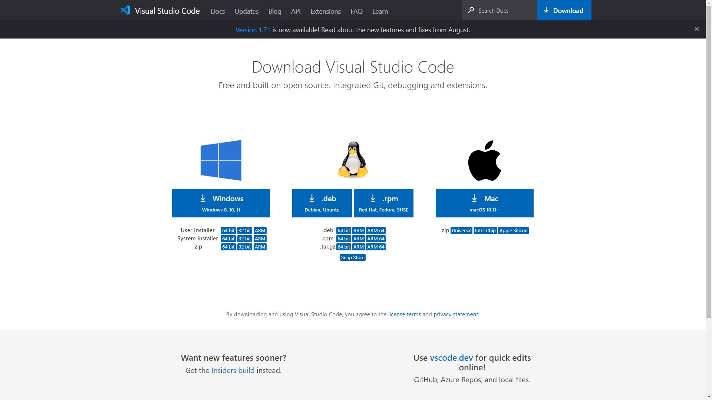
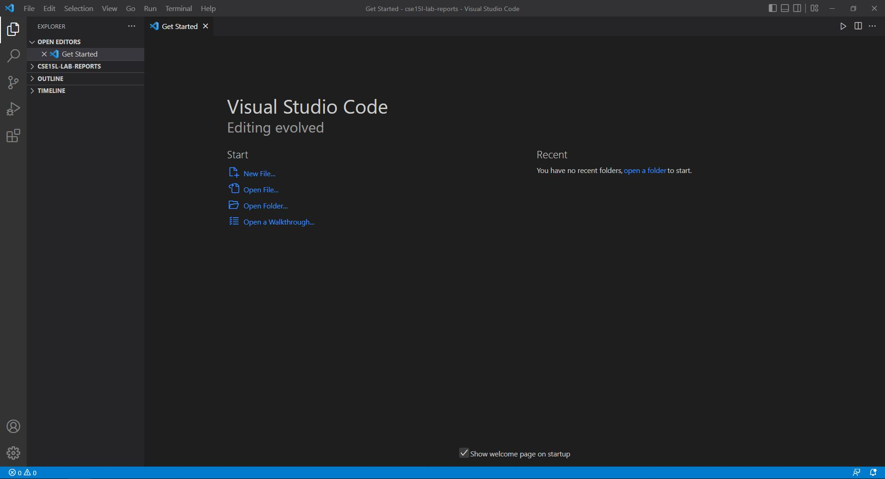
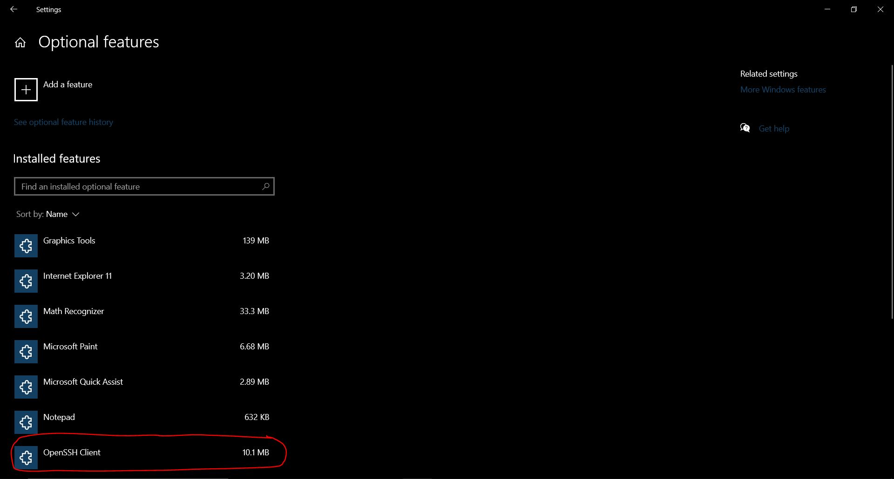
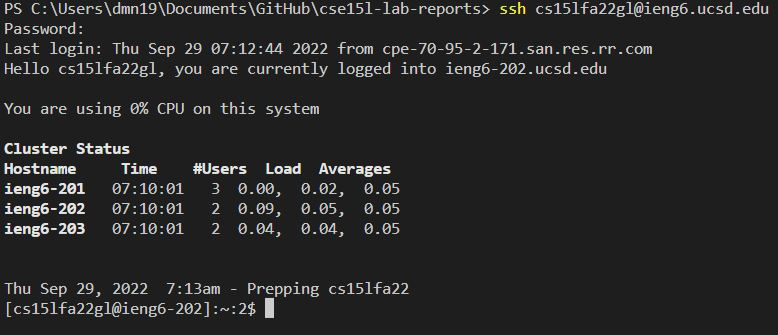
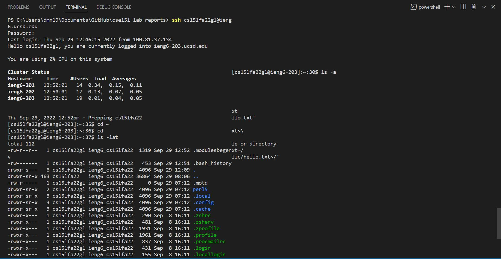
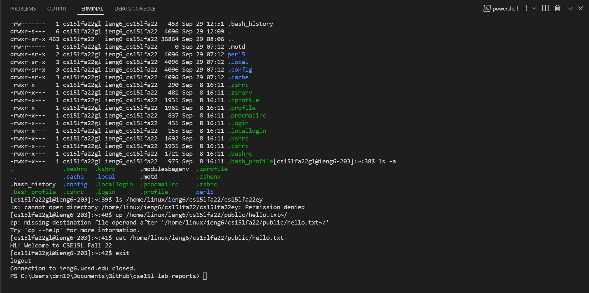
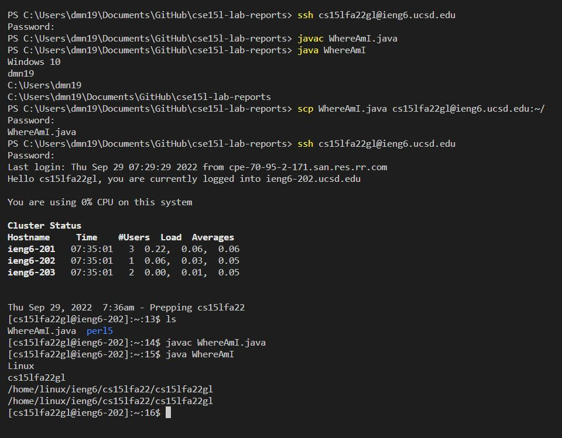
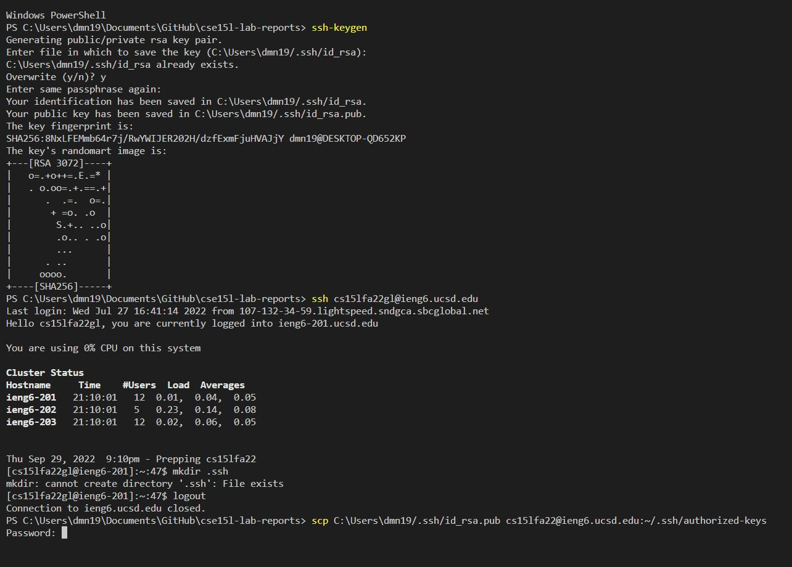
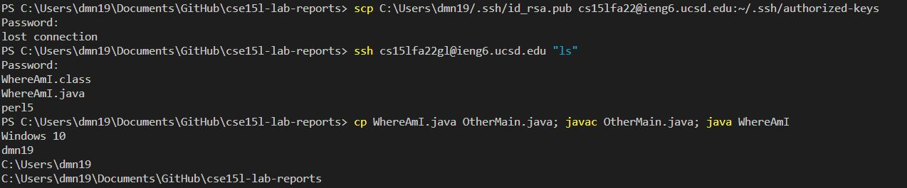

# Lab Report 1

[Step 1](https://m7duong.github.io/LabReport/week1/lab_report1.html#step-1-visual-studio-code)

[Step 2](https://m7duong.github.io/LabReport/week1/lab_report1.html#step-2-remotely-connecting)

[Step 3](https://m7duong.github.io/LabReport/week1/lab_report1.html#step-3-trying-some-commands)

[Step 4](https://m7duong.github.io/LabReport/week1/lab_report1.html#step-4-moving-files-with-scp)

[Step 5](https://m7duong.github.io/LabReport/week1/lab_report1.html#step-5-setting-an-ssh-key)

[Step 6](https://m7duong.github.io/LabReport/week1/lab_report1.html#step-6-optimizing-remote-running)

*Created by:* **Minh Nhat Duong**

Hi, this is my lab 1 report, and I will show step-by-step for how to log into a course-specific account on *ieng6*

To begin with, I highly recommend you to do this part first because you need to change your global password.
This is a link of how to do it [Change Password](https://docs.google.com/document/d/1hs7CyQeh-MdUfM9uv99i8tqfneos6Y8bDU0uhn1wqho/edit)

This is very frustrated because after you change your password, you need to wait at least 15 minutes for the system updates the account. **Please be patient :)**

## Step 1: **Visual Studio Code**

You need to download and install the Visual Studio Code for doing this lab. 
Here is a link: [VS Code](https://code.visualstudio.com/download)

When you click on that link, you will see something like the picture below. 
You will choose which operating system you are currently use.

After you are done installing, you will see the home page of VS Code like this

## Step 2: **Remotely Connecting**

I am using Window operating system, so it is useful for those who use the same as me. 
First of all, you need to follow these steps below:

    1. Click on Home button -> type Settings
    2. Go to Apps
    3. Choose *Optional features*
    4. Check if your Window has been set up OpenSSH Client yet. If you already have, please skip step 5 and 6.
    5. No? Click on "Add a feature" button 
    6. Type "OpenSSH Client" and install.

For more information of installing OpenSSH: [OpenSSH instruction](https://learn.microsoft.com/en-us/windows-server/administration/openssh/openssh_install_firstuse?tabs=gui)

After you are done with installing OpenSSH Client, open a terminal on VSCode by clicking the "Terminal" button in the bottom of your screen. 
Then, you will type this command line: ssh cs15lfa22gl@ieng6.ucsd.edu.

**Note:** Everyone will have a different account, the last 2 characters "gl" isy account, yours will be different. 

They will ask you a password, which is the one you just recently change. If you succeed, it will look the same as mine. 

## Step 3: **Trying Some Commands**

After logging in, you can play around with some commands:

  - cd ~
  - cd
  - ls -lat
  - ls -a
  - ls {directory} where {directory} is /home/linux/ieng6/cs15lfa22/cs15lfa22abc, where the abc is one of the other group members’ username
  - cp /home/linux/ieng6/cs15lfa22/public/hello.txt ~/
  - cat /home/linux/ieng6/cs15lfa22/public/hello.txt

It looks something like this: 

To logout the server account, you can do either one of this:
  - Ctrl + D
  - Type "exit"

## Step 4: **Moving Files with scp**

Now, you can upload file(s) from your computer to the remote server.

First, create a WhereAmI.java file, then copy and paste the content below:

    class WhereAmI 
    {
        public static void main(String[] args) 
        {
            System.out.println(System.getProperty("os.name"));
            System.out.println(System.getProperty("user.name"));
            System.out.println(System.getProperty("user.home"));
            System.out.println(System.getProperty("user.dir"));
        }
    }

After that, you go to terminal and compile and run the file by typing the command lines below.

    javac WhereAmI.java
    java WhereAmI

The output will display:

- {Your operating system}
- {Your repository}

**Main part:** To move the file to your remotely server, type this command line (make sure you do your account, not mine):

scp WhereAmI.java cs15lfa22gl@ieng6.ucsd.edu:~/

You will be asked the password like ssh command, but after uploading, you will go back to your computer directory. 

Finally, log in to ieng6 account with ssh command and run:

    javac WhereAmI.java
    java WhereAmI
    
The output must be different from the previous step. It will look something like this:

## Step 5: **Setting an SSH Key**

For this part, I have followed step-by-step from the professor's instruction. 
What we need to do in this part is that we can get rid of the password so we can access faster. 
My operating system is Window, and I already do an extra part, which is ssh-add, however, it is still asking me password.

## Step 6: **Optimizing Remote Running**

In this step, we will optimize copying and moving files from the personal computer to the server system.
Simply, instead of having to type in the command line to log into the system account, and then type other commands, we can combine them into one command line.
For example, we will optimize *Step 4* so we can a lot of time. You can see an example I do below:

Because I fail to do the Step 5 so my example is still asking for password. Normally, it will go directly to remote server account.
