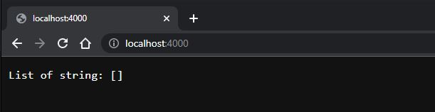
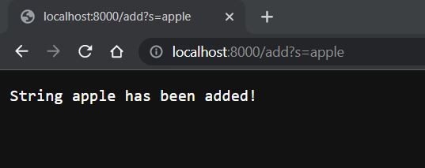
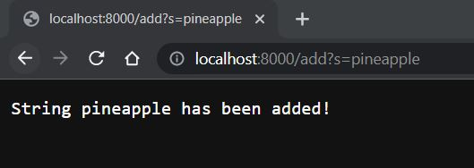
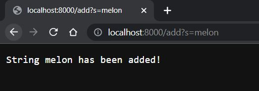
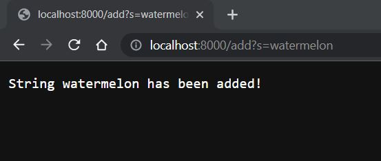
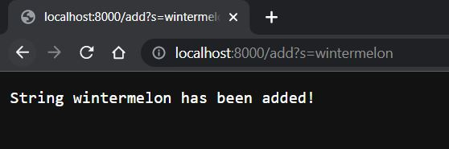
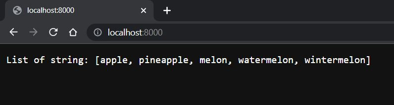
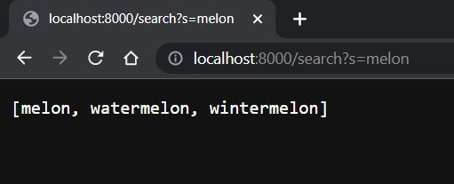

# Part 1: Simplest Search Engine

```java
import java.io.IOException;
import java.net.URI;
import java.util.ArrayList;

class Handler implements URLHandler {
    // The one bit of state on the server: a number that will be manipulated by
    // various requests.
    int num = 0;
    ArrayList list = new ArrayList();

    public String handleRequest(URI url) 
    {
        if (url.getPath().equals("/")) 
        {
            return String.format("List of string: %s\n", list.toString());
        } 

        else 
        {
            System.out.println("Path: " + url.getPath());

            if (url.getPath().contains("/add"))
            {
                String[] parameters = url.getQuery().split("=");
                if (parameters[0].equals("s")) 
                {
                    list.add(parameters[1]);
                    return String.format("String %s has been added!", parameters[1]);
                }
            }

            else if(url.getPath().contains("/search"))
            {
                String[] parameters2 = url.getQuery().split("=");
                if (parameters2[0].equals("s"))
                {
                    String search_query =  parameters2[1].toString();
                    ArrayList<String> tempList = new ArrayList<String>();

                    for (int i = 0; i < list.size(); i++)
                    {
                        if (list.get(i).toString().contains(search_query) ){
                            tempList.add(list.get(i).toString());
                            }
                        }

                        return tempList.toString();
                    }
                }

                return "404 Not Found!";
            }
        }
    }

    class SearchEngine {
        public static void main(String[] args) throws IOException {
            if(args.length == 0){
            System.out.println("Missing port number! Try any number between 1024 to 49151");
            return;
        }

        int port = Integer.parseInt(args[0]);
        Server.start(port, new Handler());
        }
    }
```

Here is a list of screenshot that I take for each step:

1. Before I add something to the list, it is an empty. For this, I simply pass the link that generate after we compile the file.



2. I add some words to the list. We are going to use add argument to add the phrase after the query to the list.











3. The list after I add elements. Use the main URL to display the list.



4. We are going to use search argument find the element in the query that has the phrase we input.



# Part 2: Find 2 bugs in 2 different files

## First code:

- Before I make a change:

```java
static void reverseInPlace(int[] arr) 
{
    for(int i = 0; i < arr.length; i += 1) 
    {
        arr[i] = arr[arr.length - i - 1];
    }
}
```

- After I make a change:

```java
static void reverseInPlace(int[] arr) 
{
    for(int i = 0; i < arr.length / 2; i += 1) 
    {
        int temp = arr[i];
        arr[i] = arr[arr.length - i - 1];
        arr[arr.length - i - 1] = temp;
    }
}
```

* Explanation: Here, we can see this code has some issues when we do the test case. It fails the test and shows that the expect is unmatch to the actual. For example, I try the test case with the array {4, 5, 6}, after doing the reverse, it should display {6, 5, 4}. But, if we follow the given code, it has a wrong order, which is display exactly the same array we input. This is call "the failure-inducing input" that it has a wrong data. Also, this code has a symptom that it fails the test output. Indeed, the output is unmatch together. Lastly, there exists a bug that it makes the code run wrong, that is the condition of the loop. By the concept, we should run this code until half of the array, because if we run to the last element of the array, it returns back to the array we input. 

* This code's bug and symptom has a connection to each other because if the code has bug(s), it will have a symptom shown that we need to fix. If we don't have a bug, the program won't have any symptom. Here, we can observe that the original code make a logical error at the beginning, which causes the symptom to be shown in the terminal when we run the test case. 

## Second code:

- Before I make a change:

```java
static List<String> filter(List<String> list, StringChecker sc) 
{
    List<String> result = new ArrayList<>();
    for(String s: list) 
    {
        if(sc.checkString(s)) 
        {
            result.add(0, s);
        }
    }
    
    return result;
}
```

- After I make a change:
```java
static List<String> filter(List<String> list, StringChecker sc) 
{
    List<String> result = new ArrayList<>();
    for(String s: list)
    {
        if(sc.checkString(s))
        {
            result.add(s);
        }
    }

    return result;
}

class Checker implements StringChecker
{
    public boolean checkString(String s)
    {
        return s.contains("H"); // Can be some string/other character based on the input.
    }
}
```

* Explanation: 
    - First of all, we can visualize the filter function from the original and after modifying is really similar. However, there is one little change that in the add method, the original makes a bug that they assign the position to add for the string. This cause the logical error because when we add in, it will go to the first element. And if we keep adding it into a list, the first element turns into the last element when we call it out. Therefore, the expect and actual are different, and this cause a symptom that the test case fails, and we need to go back and change a code into the modified program above. Here, instead of having a 0 value before the variable "s", we just take it out to make the code run correct. The reason why it is correct because we only need to return the value into true or false, it doesn't matter the order of the list. 

