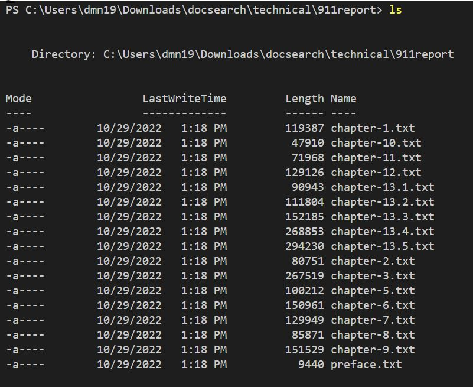
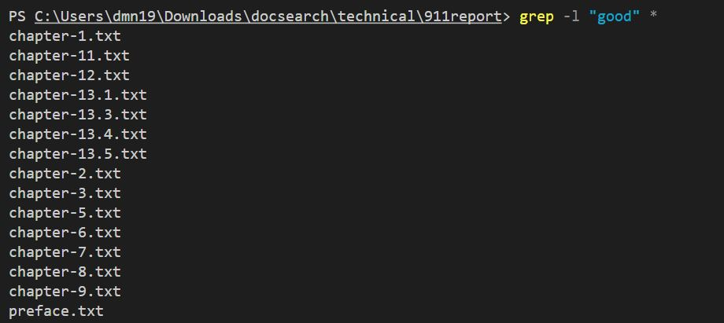
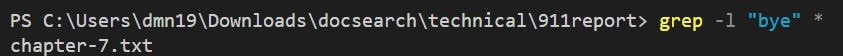
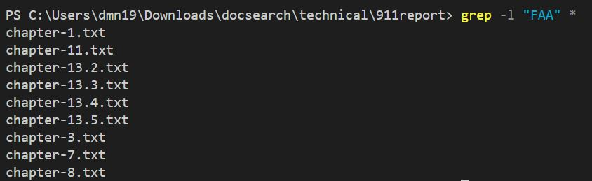
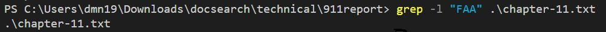
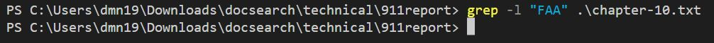
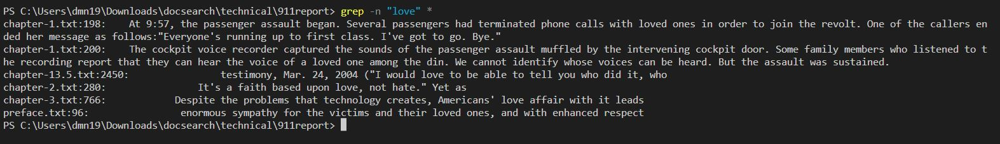
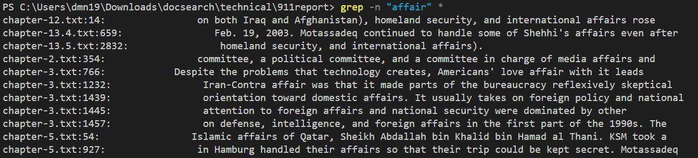
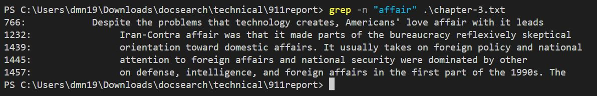
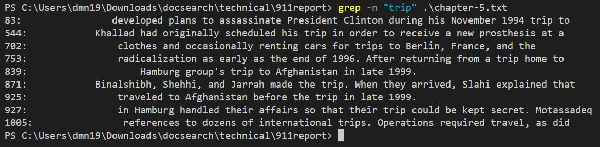

# Lab Report 3

*Created by: Minh Nhat Duong*

For this lab, I am going to choose a command `grep` and look for 3 *command-line options* for it.

**Syntax:**

`grep [options] pattern [files]`

Here are three options that I choose:

## -l: Displays list of a filenames only.

This is a list of all textfile in directory named "911report"

* *Example 1:*

After we run an example for command-line **-l**, we will have a list of text file that contains a string "good"

* *Example 2:* 

After we run an example for command-line **-l**, we will have a list of text file that contains a string "bye"

* *Example 3:* 

After we run an example for command-line **-l**, we will have a list of text file that contains a string "FAA"

If we don't use asterisk, instead, we input the textfile name, it will display that textfile name on the screen when the string is existed in file. Here is an example for string "FAA" when we use random textfile name in the "911report" directory.

  - Exist:

  - Not exist:

> In conclusion, we can see that the command-line **-l** (lowercase L) use to list out the string we input for the pattern which it exists in the textfile. The reason I use asterisk " * " because I want to list out all of textfile included the pattern I enter for the command. If I don't use asterisk, if the textfile has my input pattern, it only displays that textfile name on the screen.

## **-n**: Display the matched lines and their line numbers.

In the terminal, if we choose asterist to list out all textfile, the output will follow the order:

	1. Name of textfile .txt.
	2. Line number that exists the string input.
	3. A text that included the string input.

If we choose specific textfile, the output will follow the order:

	1. Line number that exists the string input.
	2. A text that included the string input.

* *Example 1:* string "love" in all textfile.

* *Example 2:* string "affair" in all textfile versus specific textfile

> All file:

> Specific textfile:
		

* *Example 3:* string "trip" in specific textfile

3. **-o**
