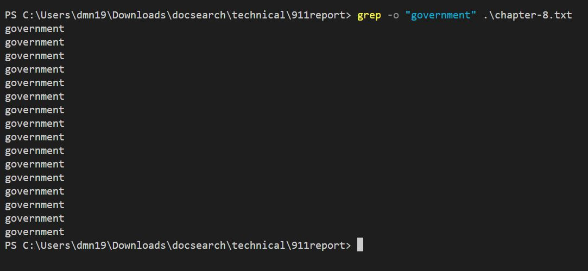
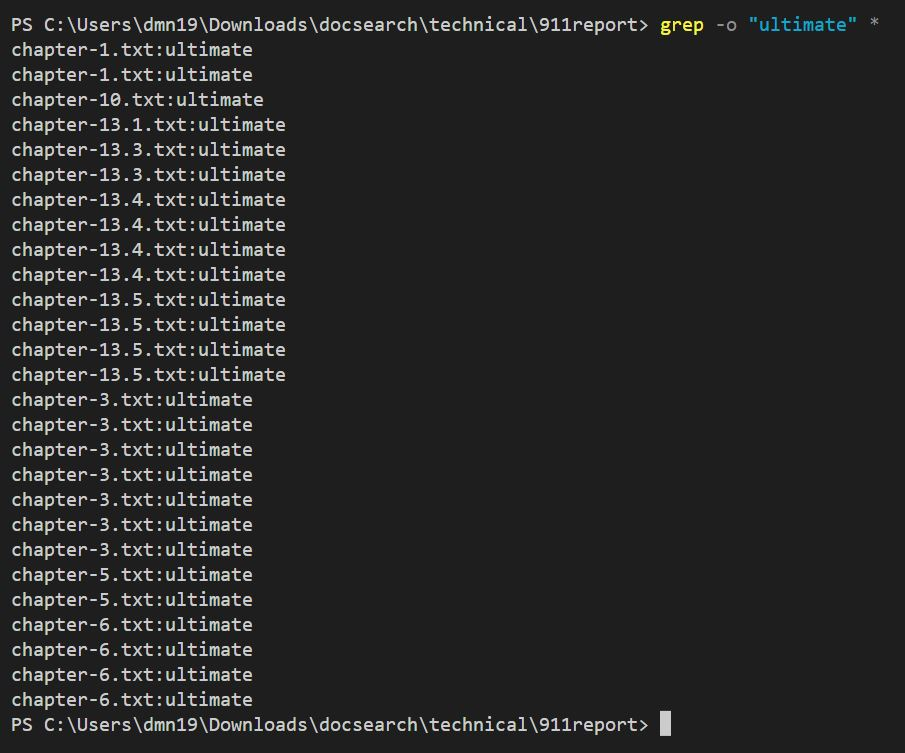
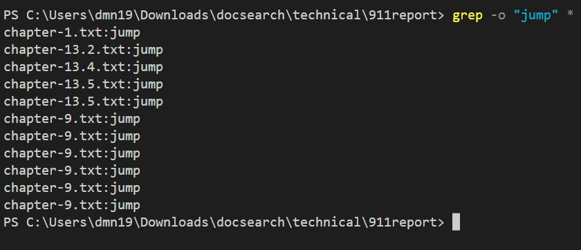
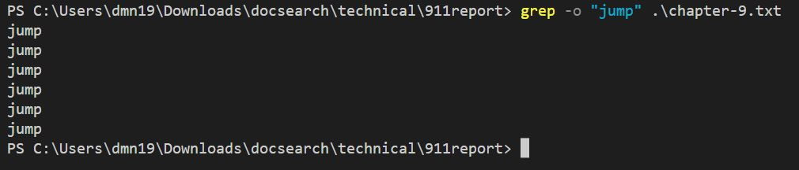

# Lab Report 3

*Created by: Minh Nhat Duong*

For this lab, I am going to choose a command `grep` and look for 3 *command-line options* for it.

**Syntax:**

`grep [options] pattern [files]`

Here are three options that I choose:

## -l: Displays list of a filenames only.

This is a list of all textfile in directory named "911report"

* *Example 1:*

After we run an example for command-line **-l**, we will have a list of text file that contains a string "good"

* *Example 2:* 

After we run an example for command-line **-l**, we will have a list of text file that contains a string "bye"

* *Example 3:* 

After we run an example for command-line **-l**, we will have a list of text file that contains a string "FAA"

If we don't use asterisk, instead, we input the textfile name, it will display that textfile name on the screen when the string is existed in file. Here is an example for string "FAA" when we use random textfile name in the "911report" directory.

  - Exist:

  - Not exist:

> In conclusion, we can see that the command-line **-l** (lowercase L) use to list out the string we input for the pattern which it exists in the textfile. The reason I use asterisk " * " because I want to list out all of textfile included the pattern I enter for the command. If I don't use asterisk, if the textfile has my input pattern, it only displays that textfile name on the screen.
> I found this useful when we can list out which file in the directory exists the term/pattern inside the double quote " " so that we can narrow down the textfile that term has. 

## **-n**: Display the matched lines and their line numbers.

In the terminal, if we choose asterist to list out all textfile, the output will follow the order:

	1. Name of textfile .txt.
	2. Line number that exists the string input.
	3. A text that included the string input.

If we choose specific textfile, the output will follow the order:

	1. Line number that exists the string input.
	2. A text that included the string input.

* *Example 1:* string "love" in all textfile.

* *Example 2:* string "affair" in all textfile versus specific textfile

> All file:

> Specific textfile:
		

* *Example 3:* string "trip" in specific textfile

> In conclusion, command-line **-n** use to display the match pattern we input in the terminal and list out text with the line number. In this command-line, there are 2 cases to display the content, which are list out all or in specific textfile.
> This command line is much more useful than -l command because it is not only list out which textfile contains the pattern, but also points out the line number it stays. Moreover, it displays a couple sentences that we can easier figure out where it exists. 

## **-o**: Print only the matched parts of a matching line, with each such part on a separate output line.

* *Example 1:* string "government" is used for pattern

* *Example 2:* string "ultimate" is used for pattern

* *Example 3:* string "jump" is used for pattern

> In conclusion, this command-line **-o** is used for listing out all strings that match to the pattern we input. It will display the input on the separate line if it found in the textfile. We can use it to know how many words (the input pattern) exist in file by counting each word on each line, as well as the number of that word in each textfile, if we use asterisk.
> This is useful that it will show all the patterns we want to find which is equal to the number it has in the file. For instance, the first example above demonstrates that we choose "government" as a pattern, and the output is a list of that pattern, a pattern for each line. From here, you can count how many times that pattern uses in a textfile. We can also use it to find in multiple textfile with the same pattern.
