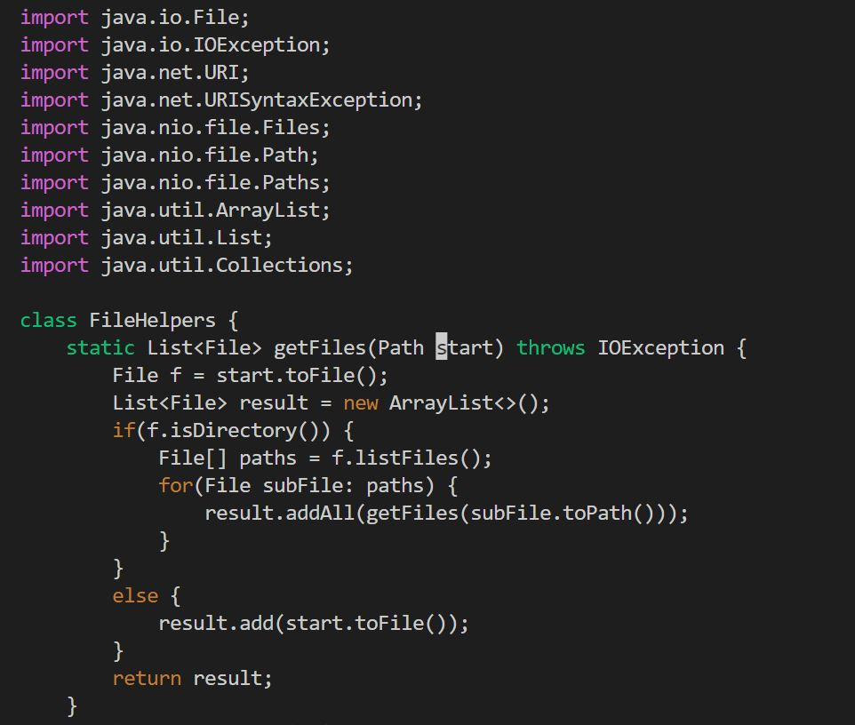
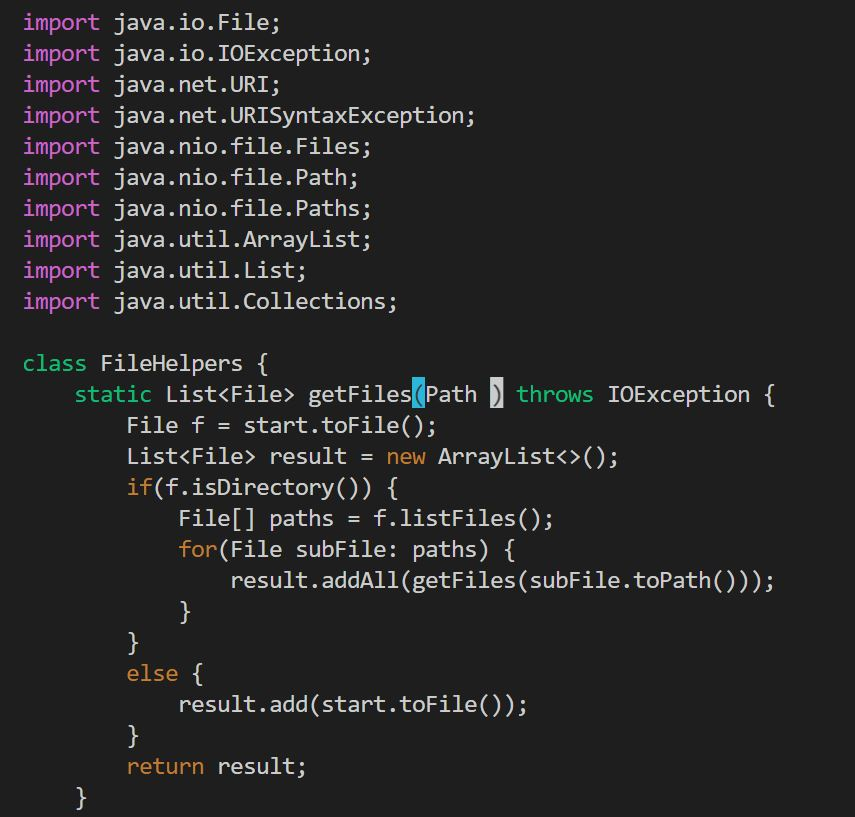
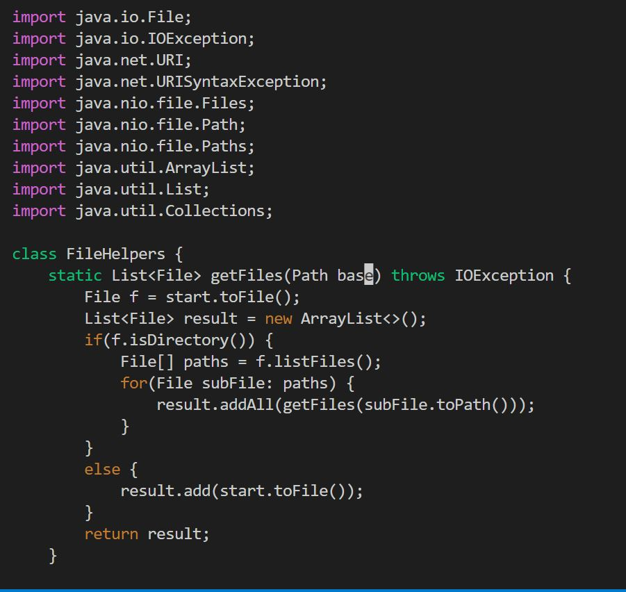
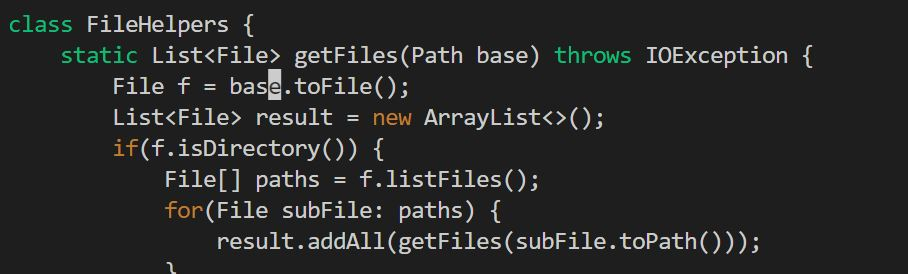
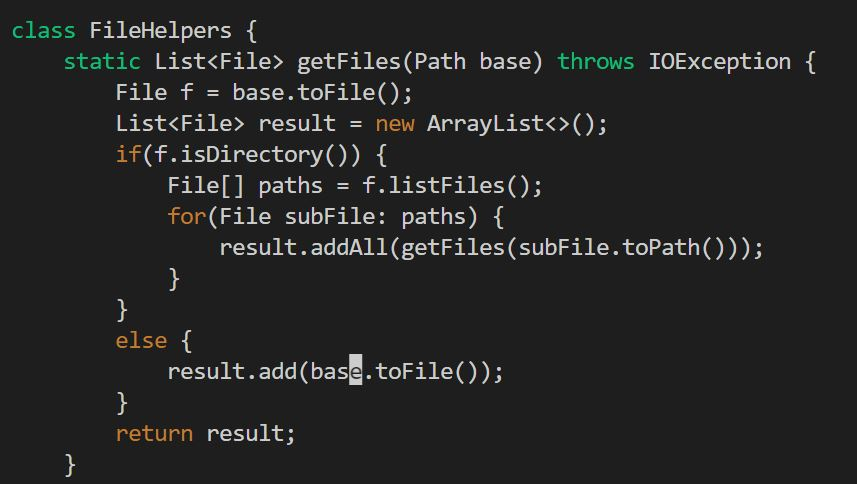
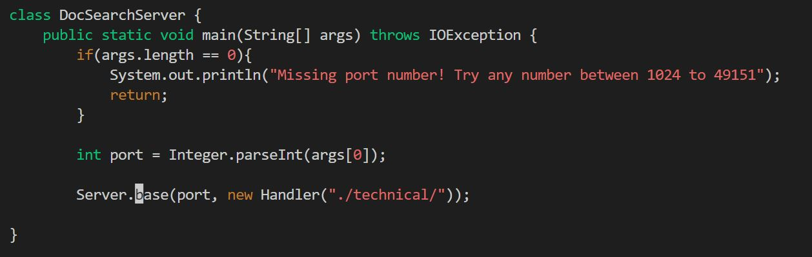
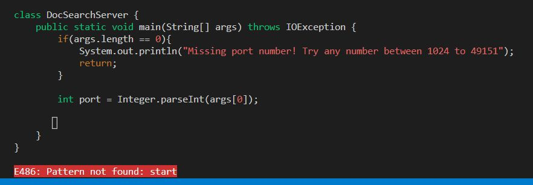

# Lab Report 4 - Vim (Week 7)

[Part 1](https://m7duong.github.io/LabReport/week7/labreport4.html#part-1)

[Part 2](https://m7duong.github.io/LabReport/week7/labreport4.html#part-2)

## Part 1

_Task_: Changing the name of the "start" parameter and its uses to "base"

Step to do: Assume we are in the "week6-skill-demo1" directory

`/start<Enter>cebase<Esc>n.n.n.n:wq<Enter>`

=> There are 25 keys pressed in total, which I found the shortest sequence of `vim` commands. 

_Description_:

* `/start<Enter>`: this will help me to move the cursor to the term we want to search. Here, we are looking for a word "start" and click Enter to start a cursor at that position. 

* `ce`: this will remove a whole word and start an Insert mode.

* `base<Esc>`: this will add a word "base" and click Esc button to log out of the insert mode.

* `n.n.n.`: this will go to the next word that we search before, which is "start", and click "." to redo the step `cebase<Esc>`. Each `n.` count as 1 time, so we need to do 3 times for changing all `start` in the program.

* `n`: we need another `n` key pressed to search for the term `start` to make sure there is nothing left. It will display a red line at the bottom left of the terminal.

* `:wq<Enter>`: this will help us save the file, then quit vim and return to the terminal.

## Part 2

> Report how long it took you to make the edit in seconds in both styles, and any difficulties or details that came up in doing so.

For starting in Visual Studio Code, after I was done everything and uploaded to server, it took me around 100 seconds to finish all tasks. About the vim option, it took me around 60 seconds to finish, which is less time than the first option.

- Some difficulties:

    * For the Visual Studio Code, I need to find a word "start" for each line, and need to scan through a program once again to make sure I don't miss out any left.         Also, I have a trouble with the Wifi connection at home to scp to the server so it takes a while to do it.

> Which of these two styles would you prefer using if you had to work on a program that you were running remotely, and why?

Personally, I prefer using vim directly on server because it's much convenience for me to fix an issue right away, and redo the task by using the "." key so it saves a lot of time. If I do it in local, I need to scroll and find the word manually, which takes me a while to finish all and maybe leave me a feeling that I miss a term left. Another reason that I consider is that for Window user, we don't have a bash command line provided, so that I need to upload the copy to server and run bash up there. In some cases, if we have any errors, we need to log out of server account and fix that issue in local, and scp again to the server. This may cause a time waste when we do a project. 

> What about the project or task might factor into your decision one way or another? (If nothing would affect your decision, say so and why!)

I know that if I work in Visual Studio Code, there are some hot keys that help me in making a decision for doing the first or second option. However, I still bias to doing t
