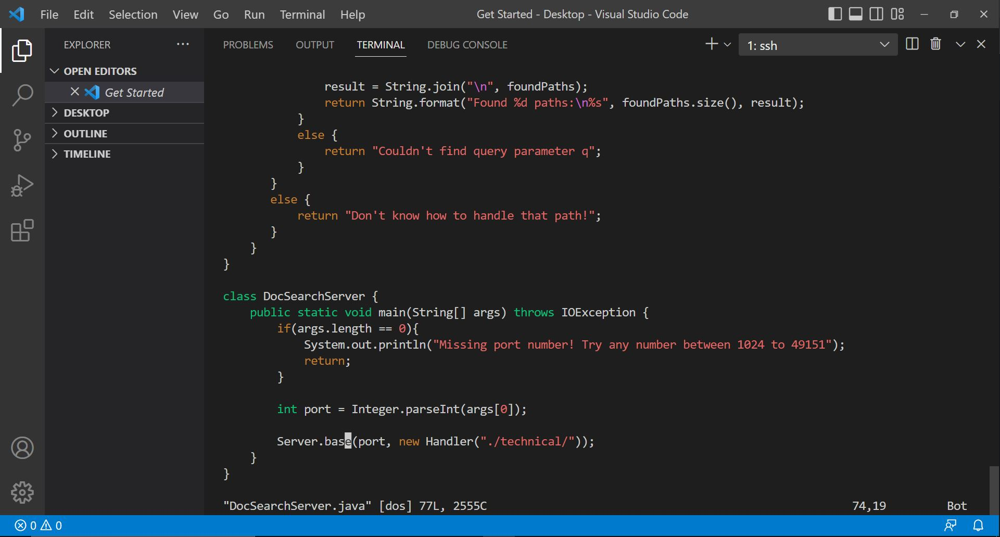

# Lab Report 4 - Vim (Week 7)

## Part 1

_Task_: Changing the name of the "start" parameter and its uses to "base"

Step to do: Assume we are in the "week6-skill-demo1" directory

`vim DocSearchServer.java<Enter>/start<Enter>cebase<Esc>n.n.n.:wq<Enter>`

_Description_:

* `vim DocSearchServer.java<Enter>`: this is the command line that we need to go into the DocSearchServer.java file by vim. Here is the output:

* `/start<Enter>`: this will help us search the term we want. Here, we are looking for a word "start" and click Enter to start a cursor at that position. 

* `ce`: this will remove a whole word and start an Insert mode.

* `base<Esc>`: this will add a word "base" and click Esc button to log out of the insert mode.

* `n.n.n.`: this will go to the next word that we search before, which is "start", and click "." to redo the step `cebase<Esc>` 3 times. 

* `:wq<Enter>`: this will help us save the file, then quit vim and return to the terminal.
