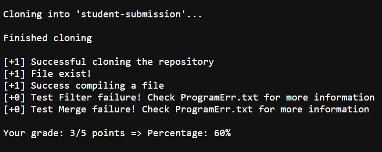
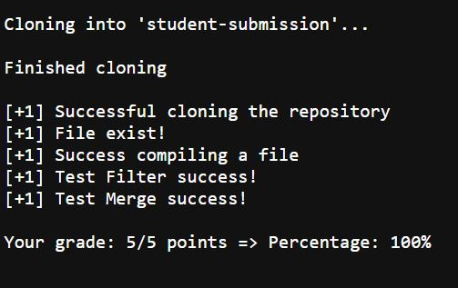
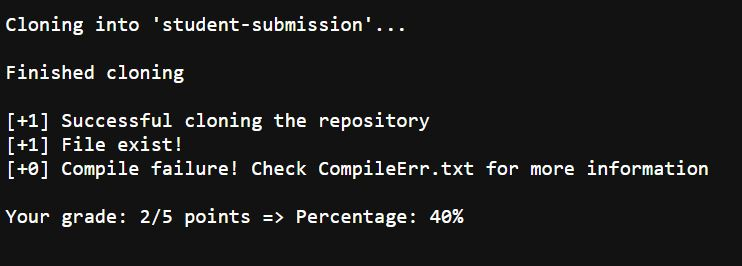

# Lab Report 5
_Created by: Minh Nhat Duong_

[Part 1 - Demonstrate](https://m7duong.github.io/LabReport/week9/lab_report5.html#part-1-demonstrate-lab)

[Part 2 - Tracing](https://m7duong.github.io/LabReport/week9/lab_report5.html#part-2-tracing)

## Part 1: Demonstrate Lab

```java
# Variables
STU_REPO=student-submission
TEST_FILE=TestListExamples
C_ERR=CompileErr
P_ERR=ProgramErr

CPATH='.:lib/hamcrest-core-1.3.jar:lib/junit-4.13.2.jar'

GRADE=0
TOTAL=5
PERCENTAGE=0

# Remove all old material to not overwriting
rm -rf $STU_REPO
rm -f *.class

# Start cloning student submission
git clone $1 $STU_REPO
echo ''
echo 'Finished cloning'
echo ''

# Check if it successfully clones the repo
if [ $? -ne 0 ]
then 
	echo '[+0] Repository is not found'
else
	echo '[+1] Successful cloning the repository'
	GRADE=$(( GRADE + 1 ))

	# Access to the repo to check if there is a java file exist
	cd $STU_REPO

	if [ ! -f 'ListExamples.java' ]
	then
		echo '[+0] No file existed!'
	else
		echo '[+1] File exist!'
		GRADE=$(( GRADE + 1 ))
	fi

	# Go back to main repo and copy the test file to student-submission repo
	cd ..
	cp $TEST_FILE.java $STU_REPO/
	cp -r lib $STU_REPO/

	# Go to student-submission repo and run JUNIT
	# We need to check whether there is any error for compiling file and run file
	cd $STU_REPO
	javac -cp $CPATH *.java 2> $C_ERR.txt

	if [ $? -ne 0 ]
	then 
		echo "[+0] Compile failure! Check $C_ERR.txt for more information"
	else
		echo '[+1] Success compiling a file'
		GRADE=$(( GRADE + 1 ))
		java -cp $CPATH org.junit.runner.JUnitCore $TEST_FILE > $P_ERR.txt

		if ( grep -q 'testFilter' $P_ERR.txt )
		then
			echo "[+0] Test Filter failure! Check $P_ERR.txt for more information"
		else
			GRADE=$(( GRADE + 1 ))
			echo '[+1] Test Filter success!'
		fi

		if ( grep -q 'testMerge' $P_ERR.txt )
		then
			echo "[+0] Test Merge failure! Check $P_ERR.txt for more information"
		else
			GRADE=$(( GRADE + 1 ))
			echo '[+1] Test Merge success!'
		fi
	fi
fi

# Display your score
PERCENTAGE=$(( $GRADE * 100 / $TOTAL ))
echo ''
echo "Your grade: $GRADE/$TOTAL points => Percentage: $PERCENTAGE%"

```







## Part 2: Tracing

I choose the first code from the list in Lab Task 7 `https://github.com/ucsd-cse15l-f22/list-methods-lab3`

I will based on the line number of code block I attach above to describe the tracing step.

**1) For each line with a command, what its _standard output_ and _standard error_ are for this run, and whether its _return code_ was zero or nonzero**

- From line 11 to line 21, I am going to initialize the variables that I can reuse it for the entire code.
- From line 23 to line 25, I am going to remove all old files and compile files so I can use the grade.sh script as many time as possible. If we don't have this step, it may be overwritten.
- From line 27 to line 31, I want to clone the student submission from github to local device to grade the assignment. Line 28 is the one we do the clone, the rest is just display on the screen the prompt to let me know it's done cloning.
- From line 33 to line 86, this is the step that I do the grading part. The total point is 5, and this whole task is going to check whether the submission is passed each test we require so that we can give point. 
- From line 88 to line 91, we want to display the point that the student submission has over the total point we have for the assignment. After that, we want to convert that point into percentage grade so that it's easier for student to keep track their grade. 

**2) For each line with an `if` statement, whether the condition was true or false, and why**

- Line 34 is to check whether the previous command passed the condition. If the previous exit status is not equal 0, which means the previous step has some problem, especially we failed to clone the student submission, then we display a sentence to let the grader know that it's failed to clone, along with the grade.
- Otherwise, after line 37, we will give 1 point for student and display a prompt to keep track. 
- Line 44 is another if statement that we need to go into the student-submission repository to check whether the ListExamples.java file exists. If it's not existed, then no point is added, otherwise, we will add one point and show the prompt to demonstrate.
- Line 62 is to check if the previous exit status is 0 or not. If not, we show the prompt and let the grader know that if they want to see what's the error, they need to check in the CompileErr.txt file for more detail. CompileErr.txt is the text file that we move all the error when we compile the JUnit test. If we have the exit status is 0 in the previous step, which means it's successfully compile the file, so we give student another point. 
- After we give the student another grade from previous step, we will run the JUnit file. Line 70 is to check the testFilter in TestListExamples.java file, if passed, we give point for student, otherwise, show an error message. 
- Line 78 is another test in TestListExamples.java, whcih is testMerge. Similar to testFilter, if it passed the test, we give point, otherwise we just show an error message. 

**Indicate each line that _does not_ run (maybe because it is in an if branch that doesn’t evaluate, or after an early exit)**

>In my code, most of the if-else statement is to check whether it's true or false. It always has a task for each one. If it passed the condition, it will be doing then part, otherwise, it jumps to the else statement part. 
